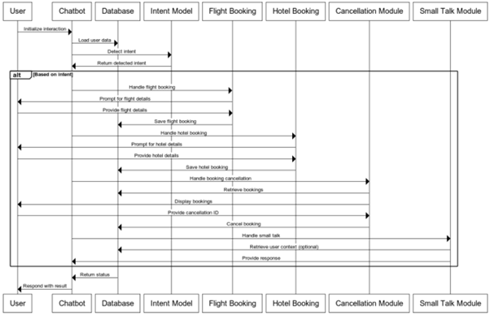

# **🤖 Travel Agent Chatbot: An NLP Demo**
## Project Overview
Welcome to the Travel Agent Chatbot, a project developed to demonstrate the power of conversational user interfaces (CUI) and natural language processing (NLP) in travel planning. This chatbot is designed as a dialogue-based system that helps users with travel-related tasks, including booking hotels and flights, managing reservations, and engaging in lighthearted small talk. This project highlights my ability to combine machine learning for intent recognition with robust transaction management and user-friendly conversational design.

## ✨ Key Features
Intent Detection: The core of the chatbot, using a machine learning model to accurately determine the user's goal from their input and classify it into predefined intent categories.

Transactional Dialogue: Facilitates structured, multi-turn conversations for complex tasks like booking flights (validating airports against a real-world dataset) and hotels, and managing cancellations.

Personalization: Achieved through an identity management system that uses Named Entity Recognition (NER) to extract and store user names, creating a more personal and engaging experience.

Small Talk Module: Includes a module to handle non-travel-related queries, making interactions feel more human and natural.

Robust Error Handling: Features a comprehensive system with input validation, user-initiated cancellation options, and fallback responses to ensure a smooth and reliable user experience even in unexpected situations.

## 🛠️ Technologies & Tools
This project was built with a modular architecture in Python, showcasing proficiency in a variety of key tools and libraries:

Language: Python

NLP: Scikit-learn for TF-IDF Vectorization and a Logistic Regression Classifier for intent detection.

Database: SQLite for lightweight, persistent storage of user information and booking data.

Code Design: A modular approach with isolated components for intent, transactions, and small talk, all managed by a central control loop.

### Overview of the Architecture



## 🚀 Getting Started
To get a copy of this project up and running on your local machine, follow these simple steps.

### Prerequisites
You will need Python installed on your machine and the necessary Python packages.

```
python --version
```

### Installation

Install the required dependencies:
```
pip install -r requirements.txt
```
 *Note: The requirements.txt file should contain a list of all necessary libraries, such as scikit-learn.*

Start the chatbot:

```
python main.py
```